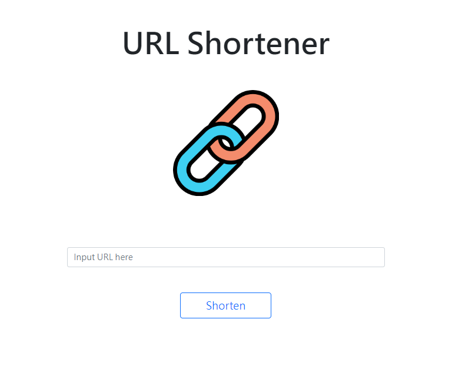
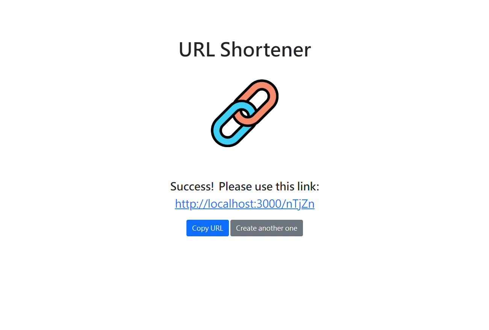

# URL Shortener





## About

Generate a shortened URL from a given URL.

### Functions

- Generate a URL from a target URL provided by user.
- Shortened URL will redirect to target URL when the server is on.
- Same target URL will generate the same shortened URL 
- Checks if target URL is blank
- Copy button to let user copy to clipboard


## Installation

1. Check if node.js and npm is installed
2. Clone project to local 
3. Navigate to the project folder via the terminal, then install：

   ```bash
   npm install
   ```

4. Set local evironment constant:

   ```bash
   export MONGODB_URI="mongodb+srv://<your_account>:<your_password>@cluster0.j9qlz5q.mongodb.net/url-shortener?retryWrites=true&w=majority"
   ```

5. Then：

   ```bash
   npm run start
   ```

6. If the code is running successfully(see message below), open your browser and go to http://localhost:3000

   ```bash
   Listening on http://localhost:3000
   mongodb connected!
   ```

7. To stop the program:

   ```bash
   ctrl + c
   ```

## Tools

- Node.js 14.16.0
- Express 4.18.1
- mongoose 6.6.1
- express-handlebars 6.0.6
